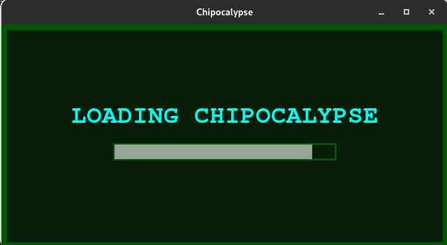
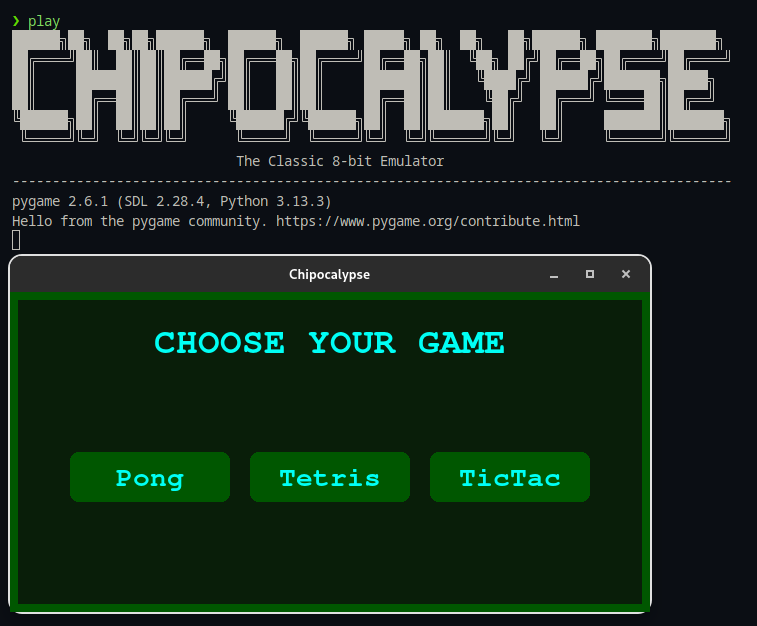

# Chipocalypse

**Chipocalypse** is a CHIP-8 emulator built entirely in **Verilog**, designed to run purely in simulation. It features a retro-style **Python GUI shell** that lets you choose from a set of classic CHIP-8 games(we can't play the game tho :( ) and visualize the output using simulation-generated frame dumps — no physical hardware is required.

The emulator is supported by lightweight **Tcl scripts** for automating simulation in Vivado, and a **minimal shell interface** with basic commands to launch the GUI, check uptime, or exit cleanly.

## How It Works

1. **Launch GUI**: Run the `/play` command or `main.py` to launch a green CRT-style game selector built using Pygame.
2. **Select Game**: Choose from `Pong`, `Tetris`, or `TicTac` (Tic-Tac-Toe). This triggers a backend Tcl script.
3. **Simulate in Vivado**: The selected ROM is loaded and simulated using `chip8_tb.v`, and a `display_dump.txt` is generated.
4. **Visualize Output**: The GUI parses and plays back frame-by-frame display output, simulating CHIP-8 screen behavior.
5. **Basic Shell Commands that Chipocalypse supports**:
   - `/play` – Launch the GUI game selector (Pong, Tetris, TicTac for now)
   - `/uptime` – Show how long the session has been running 
   - `/music` – Plays a fun background music  
   - `/help` – See available commands and usage
   - `/exit` – Exit the emulator shell  

### Screenshot below illustrates GUI 



---



The GUI and CLI together offer a clean way to run and inspect CHIP-8 ROM behavior via Verilog simulation — great for both testing and showcasing the design.

## Tools Required

- Vivado (for Verilog simulation)
- VSCode (or any Verilog-compatible editor)
- GTKWave (optional, for waveform viewing)

## Repository Structure

```
/Chipocalypse
├── docs/
├── gui/
├── misc/
├── roms/
├── scripts/
├── src/ 
├── tb/
├── README.md 
```
## Reference

- [Cowgod's CHIP-8 Technical Reference](https://devernay.free.fr/hacks/chip8/C8TECH10.HTM)
- [CHIP-8 Instruction Set Reference PDF](https://johnearnest.github.io/Octo/docs/chip8ref.pdf)
- [CHIP-8 Wikipedia](https://en.wikipedia.org/wiki/CHIP-8)

